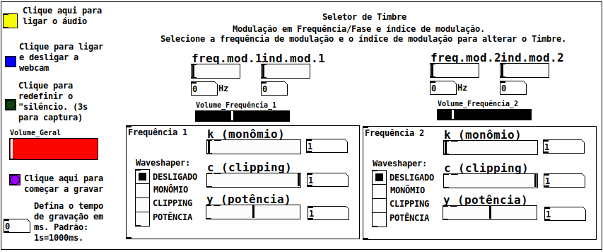
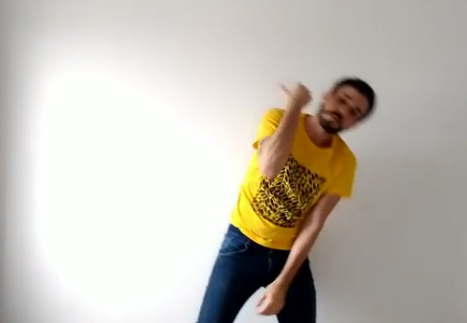
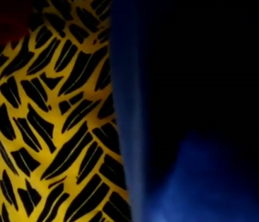
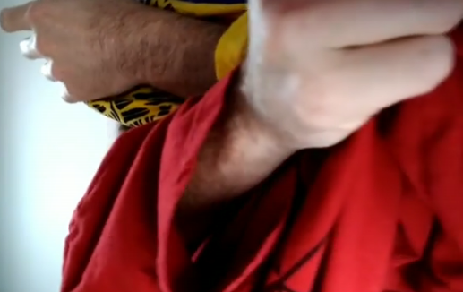

# Musicam - Webcam based digital instrument

## Digital instrument based on audio manipulation using Webcam images

### Required extensions

- Ofelia
- Zexy
- GEM

**Windows and MAC users**: If you want to run this patch quickly, you can download the DMG packages or the EXE installer of **Purr-Data** [here](https://github.com/agraef/purr-data/releases)

Performances
By [Claudinei Sevegnani](https://www.instagram.com/claudineisevegnani/) 

[Link to performance](https://www.instagram.com/p/CNn_pmKpXXF/?utm_source=ig_web_copy_link)

[Link to performance](https://www.instagram.com/p/CNn0ssZJi0A/?utm_source=ig_web_copy_link)

[Link to performance](https://www.instagram.com/p/CNnxPcwJDqA/?utm_source=ig_web_copy_link)

### For more information, contact-me clicking [here](mailto:lealdecastro@gmail.com).